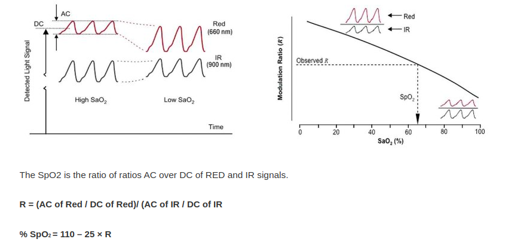

# 1. Theory
- To caculate Spo2 from PPG signal, we need two types of data is IR PPG and RED PPG
    

    
     
    <i>Figure 1: Formula to Calculate SpO2</i>
    

- SpO2 = 110 - 25*R with R defined above picture

# 2. Result
- This is the result I collected data by sensr MAX30102 and processing signal by python.
    

    
     
    <i>Figure 2: Result SpO2</i>
    

    
