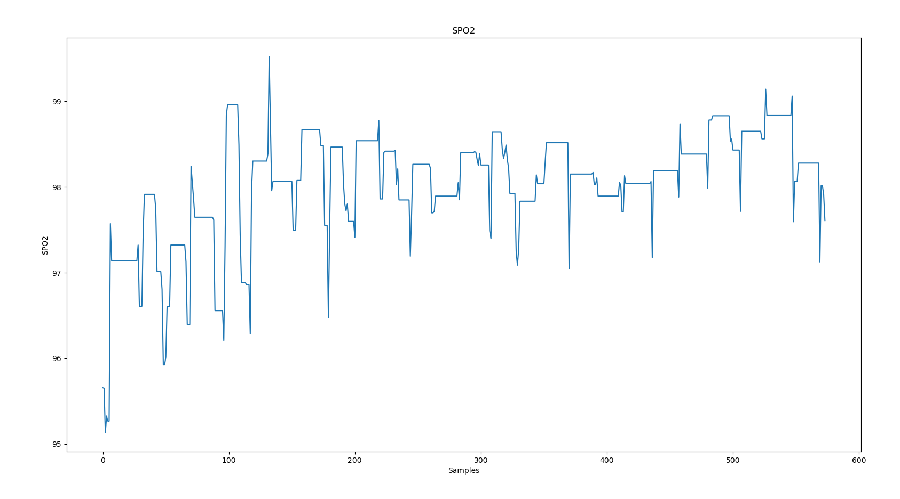

# 1. Theory
- To caculate Spo2 from PPG signal, we need two types of data is from IR light and RED light.

    
     
    <b>Figure 1: Formula to Calculate SpO2</b>

- SpO2 = 110 - 25*R with R defined above picture.

# 2. Result
- Figure 2 is the result I collected data by sensor MAX30102 and caculate SpO2 by python.

    
     
    <b>Figure 2: Result SpO2</b>

